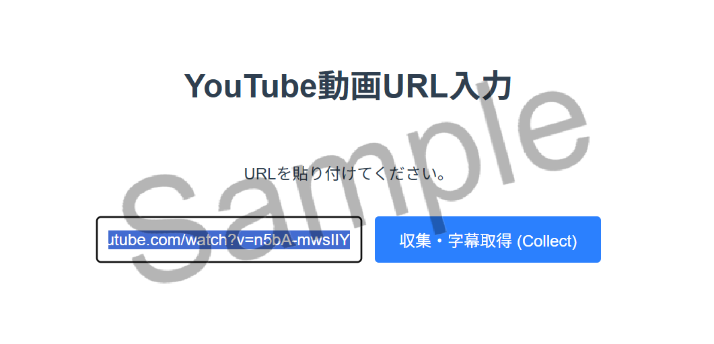
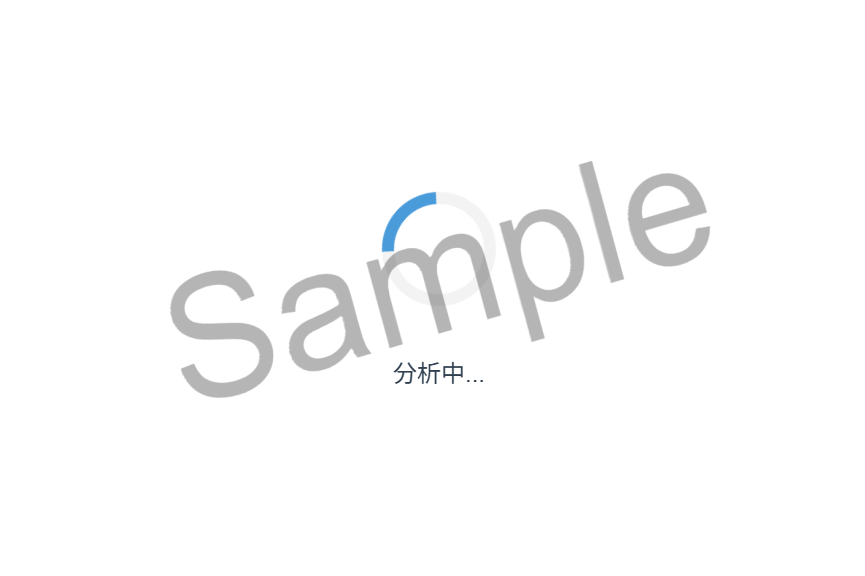
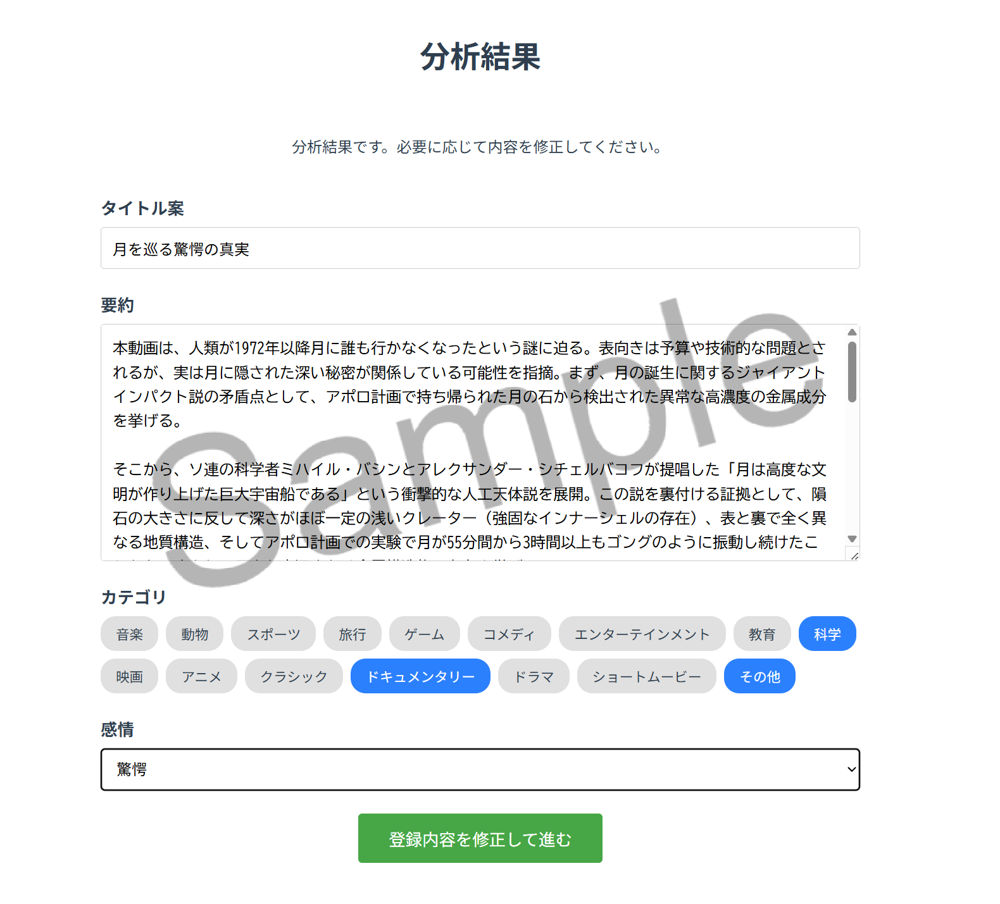
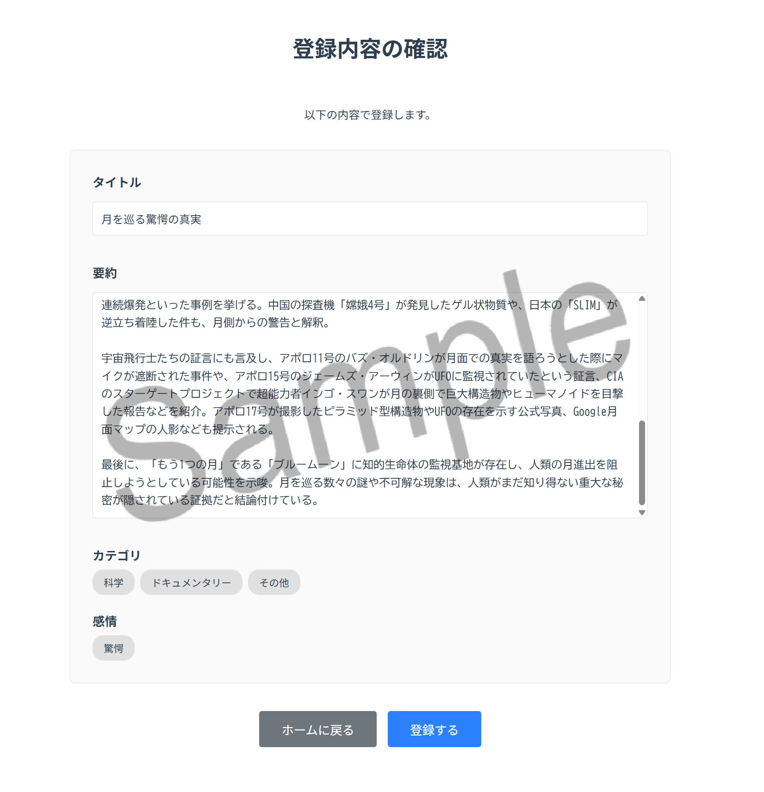
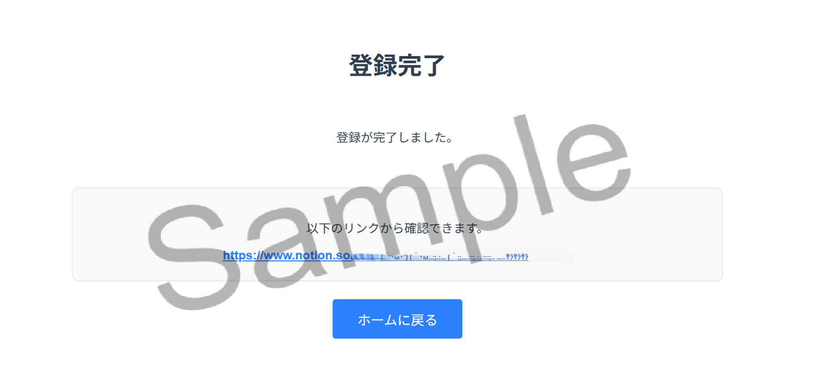
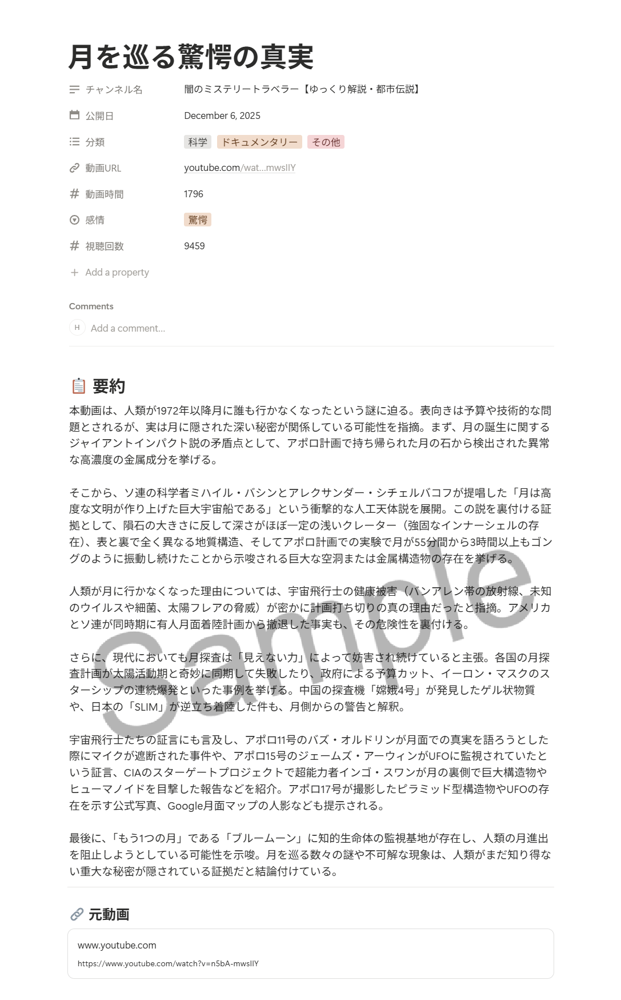
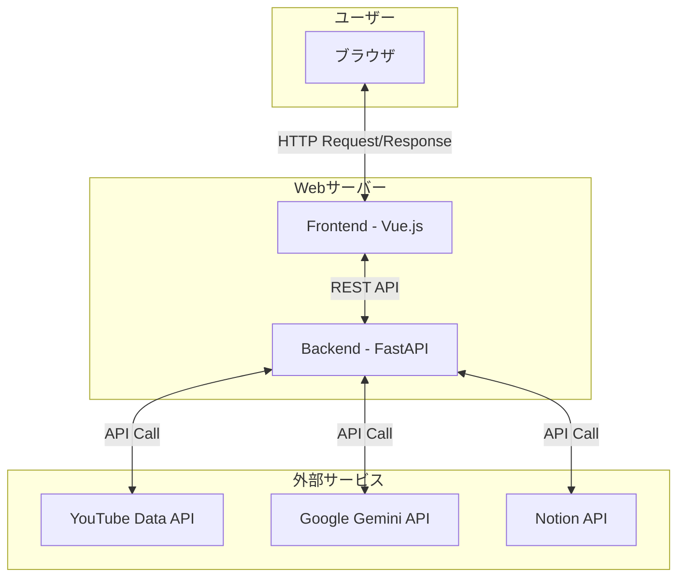

# YouTube Notion Register

YouTube動画の内容を分析し、指定したNotionデータベースに自動で登録するためのWebアプリケーションです。


## 📖 プロジェクト概要

このプロジェクトは、Webアプリケーション開発の実践的な知識を習得することを目的として作成されました。  
好きなYouTubeチャンネルの動画情報を効率的に収集・整理し、個人のナレッジベースとして活用するシナリオを想定しています。

### 主な機能

本アプリケーションは、以下の3つのステップで動画をNotionに登録します。

1.  **データ収集 (Collect)**
    *   指定されたYouTube動画のURLから、タイトル、チャンネル名、公開日、再生時間などのメタデータを取得します。
    *   同時に、動画の字幕データを取得します。
2.  **分析・要約 (Analyze)**
    *   取得した字幕データをGoogle Gemini APIに送信し、動画の内容を要約します。
    *   要約と同時に、内容に基づいたカテゴリ、感情タグ、推奨タイトルをAIが生成します。
3.  **Notion登録 (Register)**
    *   AIが生成した内容をユーザーが確認・修正し、ボタン一つで指定のNotionデータベースに登録します。
    *   Notionページには、動画の要約、タイトル、各種メタデータ、サムネイルなどが自動で入力されます。

## 🖼️ スクリーンショット

1.  **URL入力**  
    分析したいYouTube動画のURLを入力します。
    

2.  **分析中**  
    AIが動画の字幕を基に内容を分析・要約します。
    

3.  **分析結果の確認・修正**  
    AIが生成したタイトルや要約を、ユーザーが確認し、必要に応じて修正します。
    

4.  **登録内容の確認**  
    Notionに登録する最終的な内容を確認します。
    

5.  **登録完了**  
    登録が完了すると、作成されたNotionページへのリンクが表示されます。
    

6.  **Notion登録結果**  
    収集・分析した情報がNotionデータベースにきれいに整理されて登録されます。
    


## ✨ システム構成

このアプリケーションは、フロントエンドとバックエンドが分離した構成になっています。



## 🛠️ 技術スタック

| 領域         | 技術                                        |
| :----------- | :------------------------------------------ |
| **フロントエンド** | Vue.js 3, TypeScript, Vite, Pinia, Axios    |
| **バックエンド**   | Python 3.10+, FastAPI, Pydantic, Uvicorn    |
| **AI / LLM**     | Google Gemini API                           |
| **API**          | YouTube Data API v3, Notion API             |
| **その他**       | Docker, Nginx (本番環境), Pytest, Vitest    |

## 🚀 環境構築と実行方法

### 0. 前提条件

本アプリケーションを動作させるには、以下のソフトウェアがインストールされている必要があります。

- Git
- Docker と Docker Compose
- Node.js (v18以上推奨)
- Python (3.10以上)


### 1. リポジリのクローン

```bash
git clone https://github.com/HI-0705/youtube-notion-register.git
cd youtube-notion-register
```

### 2. 環境変数の設定

`.env.example` ファイルをコピーして `.env` ファイルを作成し、中身を編集します。  
各APIキーとNotionデータベースIDを設定してください。

```bash
cp .env.example .env
```

**.env**
```
# YouTube Data API
YOUTUBE_API_KEY=your-youtube-api-key-here

# Google Gemini API
GEMINI_API_KEY=your-gemini-api-key-here

# Notion API
NOTION_API_KEY=your-notion-integration-token-here
NOTION_DATABASE_ID=your-database-id-here

# ... その他設定
```

### 3. アプリケーションの起動 (Docker)

Docker と Docker Compose がインストールされている場合、以下のコマンドで簡単に起動できます。

```bash
docker-compose up -d --build
```

-   フロントエンド: `http://localhost:5173`
-   バックエンド: `http://localhost:8000/docs` (APIドキュメント)

### 4. 手動での起動 (Dockerなし)

**バックエンド**
```bash
# backend ディレクトリに移動
cd backend

# 仮想環境の作成と有効化
python -m venv venv
source venv/bin/activate  # Windows: venv\Scripts\activate

# 依存関係のインストール
pip install -r requirements.txt

# サーバーの起動
uvicorn app.main:app --reload --host 0.0.0.0 --port 8000
```

**フロントエンド**
```bash
# 別のターミナルで frontend ディレクトリに移動
cd frontend

# 依存関係のインストール
npm install

# 開発サーバーの起動
npm run dev
```

## 📝 APIエンドポイント

| エンドポイント                  | メソッド | 説明                                       |
| :------------------------------ | :------- | :----------------------------------------- |
| `/api/v1/health`                | `GET`    | ヘルスチェック                             |
| `/api/v1/collect`               | `POST`   | YouTube動画のデータと字幕を収集する         |
| `/api/v1/analyze`               | `POST`   | 収集したデータを基にAIで分析・要約する     |
| `/api/v1/register`              | `POST`   | 分析結果をNotionデータベースに登録する     |
| `/api/v1/sessions/{session_id}` | `GET`    | 現在のセッション情報を取得する             |


## 📄 ライセンス

このプロジェクトは MIT License のもとで公開されています。詳細は [LICENSE](LICENSE) ファイルをご確認ください。

### 注意事項

本アプリケーションは学習目的で作成したものであり、実用性や完全なバグフリーを保証するものではありません。  
作者は本ソフトウェアの使用によって生じたいかなる損害についても、一切の責任を負いません。自己責任でご利用ください。
